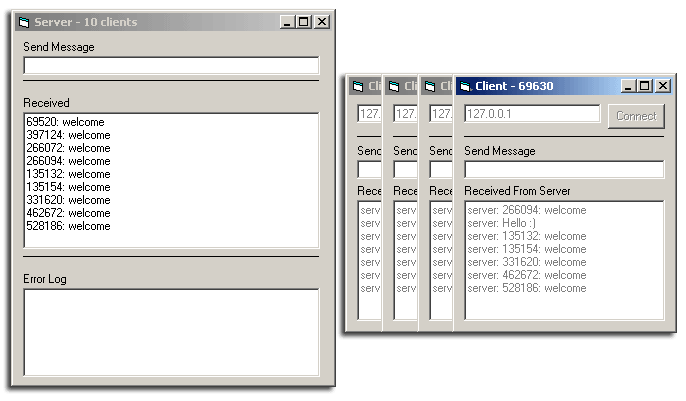



## Basic TCP/IP Multi\-Client Echo Server

### Description

A basic Echo-Server, which accepts up to 65536 clients. Great as the base for your game, a chat or something similar. Winsock-Controls will be generated at runtime, and disconnected Ports will be re-used. Clear and commented code without special features. Say: A Template.

--- Please drop me a line, if you find a bug or have a better algorithm for something. If you use it, it would be nice to vote :)
 
### More Info
 

             |
---                |---
**Submitted On**   |2002-10-09 05:54:04
**By**             |[Ninnghizidha](https://github.com/Planet-Source-Code/PSCIndex/blob/master/ByAuthor/ninnghizidha.md)
**Level**          |Intermediate
**User Rating**    |4.9 (39 globes from 8 users)
**Compatibility**  |VB 5\.0, VB 6\.0
**Category**       |[Complete Applications](https://github.com/Planet-Source-Code/PSCIndex/blob/master/ByCategory/complete-applications__1-27.md)
**World**          |[Visual Basic](https://github.com/Planet-Source-Code/PSCIndex/blob/master/ByWorld/visual-basic.md)
**Archive File**   |[Basic\_TCP\_1431551092002\.zip](https://github.com/Planet-Source-Code/ninnghizidha-basic-tcp-ip-multi-client-echo-server__1-39661/archive/master.zip)

